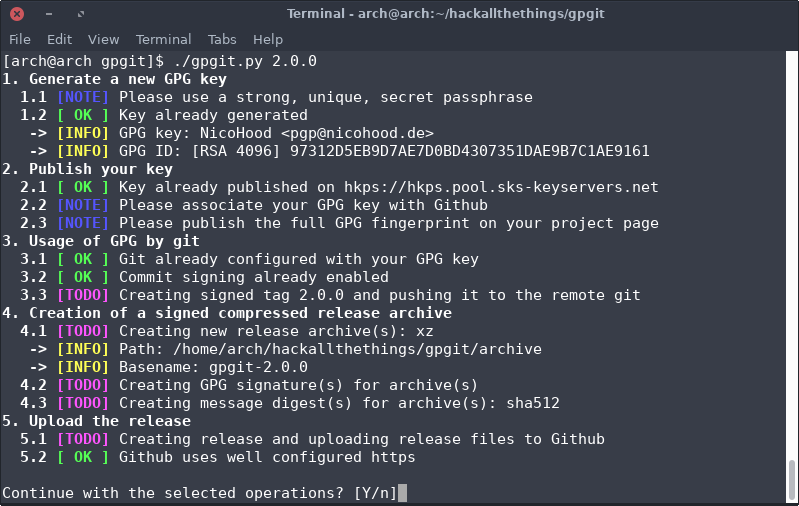

# GPGit


# Introduction
As we all know, today more than ever before, it is crucial to be able to trust our computing environments. One of the main difficulties that package maintainers of GNU/Linux distributions face, is the difficulty to verify the authenticity and the integrity of the source code. With GPG signatures it is possible for packagers to verify source code releases quickly and easily.

#### Overview of the required tasks:
* Create and/or use a **[4096-bit RSA/Ed25519 ECC keypair][1]** for the file signing
* Use a **[strong, unique, secret passphrase][2]** for the key
* Upload the public key to a **[key server][3]** and **[publish the full fingerprint][4]**
* **[Sign][5]** every new Git **[commit][6]** and **[tag][7]**
* Create **[signed][8], [compressed release archives][9]**
* Upload a **[strong message digest][10]** of the archive
* Configure **[HTTPS][11]** for your download server

<a href="https://www.buymeacoffee.com/nicohood" target="_blank"></a>

### GPGit
[GPGit][12] is meant to bring GPG to the masses. It is not only a shell script that automates the process of [creating new signed Git releases with GPG][13], but also includes a [quick-start-guide][14] for learning how to use GPG. GPGit integrates perfectly with the [Github Release API][15] for uploading. It can even automatically add a [Keep A Changelog](https://keepachangelog.com/) formatted changelog to the release.

The security status of GNU/Linux projects will be tracked in the [Linux Security Database][16]. If you have any further questions, do not hesitate to [contact me][17] personally. Thanks for your help in making GNU/Linux projects more secure by using GPG signatures.

[1]: https://github.com/NicoHood/gpgit#12-key-generation
[2]: https://github.com/NicoHood/gpgit#11-strong-unique-secret-passphrase
[3]: https://github.com/NicoHood/gpgit#21-send-gpg-key-to-a-key-server
[4]: https://github.com/NicoHood/gpgit#22-publish-full-fingerprint
[5]: https://github.com/NicoHood/gpgit#31-configure-git-gpg-key
[6]: https://github.com/NicoHood/gpgit#32-commit-signing
[7]: https://github.com/NicoHood/gpgit#33-create-signed-git-tag
[8]: https://github.com/NicoHood/gpgit#42-sign-the-archive
[9]: https://github.com/NicoHood/gpgit#41-create-compressed-archive
[10]: https://github.com/NicoHood/gpgit#43-create-the-message-digest
[11]: https://github.com/NicoHood/gpgit#51-configure-https-download-server
[12]: https://github.com/NicoHood/gpgit
[13]: https://github.com/NicoHood/gpgit#script-usage
[14]: https://github.com/NicoHood/gpgit#gpg-quick-start-guide
[15]: https://github.com/NicoHood/gpgit#52-upload-to-github
[16]: https://github.com/NicoHood/LSD
[17]: http://contact.nicohood.de

# Index
* [Introduction](#introduction)
* [GPGit Documentation](#gpgit-documentation)
* [GPG Quick Start Guide](#gpg-quick-start-guide)

# GPGit Documentation

## Installation

### Arch Linux

GPGit is available as [official Arch Linux distribution package](https://archlinux.org/packages/extra/any/gpgit/):

```bash
sudo pacman -S gpgit
# Optional dependencies for Github API uploading
sudo pacman -S curl jq
```

### Debian

First install the following dependencies, then follow the manual installation instruction.

```bash
# Install dependencies
sudo apt-get install bash gnupg2 git tar xz-utils coreutils gawk grep sed util-linux
# Optional dependencies
sudo apt-get install gzip bzip lzip zstd file jq curl
```

### MacOS

First install the following dependencies with [Homebrew](https://brew.sh/), then follow the manual installation instructions.

```bash
# Install dependencies
brew install bash git xz gnu-getopt coreutils
# Install a GPG suite, such as https://gpgtools.org/
brew install --cask gpg-suite
# Optional dependencies
brew install gzip bzip2 lzip zstd jq curl
```

### Manual Installation

#### Dependencies

* bash
* gnupg2
* git
* tar
* xz
* grep
* sed
* gnu awk
* gnu getopt (util-linux)
* gnu date (coreutils)

#### Optional Dependencies

* gzip (Compression option)
* zstd (Compression option)
* bzip (Compression option)
* lzip (Compression option)
* file (Github API upload)
* jq (Github API upload)
* curl (Github API upload)
* shellcheck (Development: `make test`)

#### Installation Instructions

```bash
# Download and verify source
VERSION=1.5.0
wget "https://github.com/NicoHood/gpgit/releases/download/${VERSION}/gpgit-${VERSION}.tar.xz"
wget "https://github.com/NicoHood/gpgit/releases/download/${VERSION}/gpgit-${VERSION}.tar.xz.asc"
gpg2 --keyserver hkps://keyserver.ubuntu.com --recv-keys 97312D5EB9D7AE7D0BD4307351DAE9B7C1AE9161
gpg2 --verify "gpgit-${VERSION}.tar.xz.asc" "gpgit-${VERSION}.tar.xz"

# Extract, install and run GPGit
tar -xf "gpgit-${VERSION}.tar.xz"
sudo make -C "gpgit-${VERSION}" PREFIX=/usr/local install
gpgit --help
```

## Script Usage
The script guides you through all 5 steps of the [GPG quick start guide](#gpg-quick-start-guide). Run GPGit with the tag name as parameter. All other options will get auto detected. When running the script for the first time GPGit runs in interactive (`-i`) mode and guide you through all steps of secure source code signing.

If you add and commit a `CHANGELOG.md` file to your Git with the [Keep a Changelog](https://keepachangelog.com/) format, GPGit will autodetect that file and add the corresponding changelog section to the tag message and Github release notes.

### Sample Usage


### Parameters and Configuration
```
$ gpgit --help
Usage: gpgit [options] <tagname> [<commit> | <object>]

GPGit 1.5.0 https://github.com/NicoHood/gpgit
A shell script that automates the process of signing Git sources via GPG.

Mandatory arguments:
  <tagname>                The name of the tag to create.

Optional arguments:
  -h, --help               Show this help message and exit.
  -m, --message <msg>      Use the given <msg> as the commit message.
                           If multiple -m options are given, their values are
                           concatenated as separate paragraphs.
  -C, --directory <path>   Run as if GPGit was started in <path> instead of the
                           current working directory.
  -u, --local-user <keyid> Use the given GPG key (same as --signingkey).
  -o, --output <path>      Safe all release assets to the specified <path>.
  -a, --asset              Add additional Github assets, e.g. software bundles.
  -t, --title              Custom Github release title (instead of tag name).
  -p, --pre-release        Flag as Github pre-release.
  -f, --force              Force the recreation of Git tag and release assets.
  -i, --interactive        Run in interactive mode, step-by-step.
      --<option>           Temporary set a 'gpgit.<option>' from config below.
  <commit>, <object>       The object that the new tag will refer to.

Examples:
  gpgit 1.0.0
  gpgit -p -m "First alpha release." 0.1.0 --hash "sha256 sha512"
  gpgit -C git/myproject/ -o /tmp/gpgit -n -m "Internal test release." 0.0.1

Configuration options:
  gpgit.signingkey <keyid>, user.signingkey <keyid>
  gpgit.output <path>
  gpgit.token <token>
  gpgit.compression <xz | gzip | bzip2 | lzip | zstd | zip>
  gpgit.hash <sha512 | sha384 | sha256 | sha1 | md5>
  gpgit.changelog <auto | true | false>
  gpgit.github <auto | true | false>
  gpgit.githubrepo <username/projectname>
  gpgit.project <projectname>
  gpgit.keyserver <keyserver>

Examples:
  git config --global gpgit.output ~/gpgit
  git config --local user.signingkey 97312D5EB9D7AE7D0BD4307351DAE9B7C1AE9161
  git config --local gpgit.compression "xz zip"
```

# GPG Quick Start Guide
GPGit guides you through 5 simple steps to get your software project ready with GPG signatures. Further details can be found below.

1. [Generate a new GPG key](#1-generate-a-new-gpg-key)
    1. [Strong, unique, secret passphrase](#11-strong-unique-secret-passphrase)
    2. [Key generation](#12-key-generation)
2. [Publish your key](#2-publish-your-key)
    1. [Send GPG key to a key server](#21-send-gpg-key-to-a-key-server)
    2. [Publish full fingerprint](#22-publish-full-fingerprint)
    3. [Associate GPG key with Github](#23-associate-gpg-key-with-github)
3. [Use Git with GPG](#3-use-git-with-gpg)
    1. [Configure Git GPG key](#31-configure-git-gpg-key)
    2. [Enble commit signing](#32-enable-commit-signing)
    3. [Create signed Git tag](#33-create-signed-git-tag)
4. [Create a signed release archive](#4-create-a-signed-release-archive)
    1. [Create compressed archive](#41-create-compressed-archive)
    2. [Sign the archive](#42-sign-the-archive)
    3. [Create the message digest](#43-create-the-message-digest)
5. [Upload the release](#5-upload-the-release)
    1. [Configure HTTPS download server](#51-configure-https-download-server)
    2. [Upload to Github](#52-upload-to-github)

## 1. Generate a new GPG key
### 1.1 Strong, unique, secret passphrase
Make sure that your new passphrase for the GPG key meets high security standards. If the passphrase/key is compromised all of your signatures are compromised too.

Here are a few examples how to keep a passphrase strong but easy to remember:
* [Creating a strong password](https://support.google.com/accounts/answer/32040?hl=en)
* [How to Create a Secure Password](https://open.buffer.com/creating-a-secure-password/)
* [Mooltipass](https://www.themooltipass.com/)
* [Keepass](https://keepass.info/), [KeepassXC](https://keepassxc.org/)
* [PasswordCard](https://www.passwordcard.org/en)

### 1.2 Key generation
If you don't have a GPG key yet, create a new one first. You can use RSA (4096 bits) or ECC (Curve 25519) for a strong key. GPG offers you the option to use the most future-proof key algorithm available. Use the most recent version gnupg2, not gnupg1!

Ed25519 ECC GPG keys are still not supported by every software/platform. To generate an RSA key use `rsa4096`  instead of `future-default` as parameter.

**Make sure that your secret key is stored somewhere safe and use a unique strong password.**

##### Example key generation:
```bash
$ gpg2 --quick-generate-key "John Doe <john@doe.com>" future-default default 1y
We need to generate a lot of random bytes. It is a good idea to perform
some other action (type on the keyboard, move the mouse, utilize the
disks) during the prime generation; this gives the random number
generator a better chance to gain enough entropy.
gpg: key 2F8E73B1D445CCD3 marked as ultimately trusted
gpg: revocation certificate stored as '/home/john/.gnupg/openpgp-revocs.d/6718A9A63030E182A86FEE152F8E73B1D445CCD3.rev'
public and secret key created and signed.

pub   ed25519 2017-09-24 [SC] [expires: 2018-09-24]
      6718A9A63030E182A86FEE152F8E73B1D445CCD3
uid                      John Doe <john@doe.com>
sub   cv25519 2017-09-24 [E]
```

The generated key has the fingerprint `6718A9A63030E182A86FEE152F8E73B1D445CCD3` in this example. Share it with others so they can verify your source. [[Read more]](https://wiki.archlinux.org/index.php/GnuPG#Create_a_key_pair)

If you ever move your installation make sure to backup `~/.gnupg/` as it contains the **private key** and the **revocation certificate**. Handle it with care. [[Read more]](https://wiki.archlinux.org/index.php/GnuPG#Revoke_a_key)

## 2. Publish your key

### 2.1 Send GPG key to a key server
To make the public key widely available, upload it to a key server. Now the user can get your key by requesting the fingerprint from the keyserver: [[Read more]](https://wiki.archlinux.org/index.php/GnuPG#Use_a_keyserver)

```bash
# Publish key
gpg2 --keyserver hkps://keyserver.ubuntu.com --send-keys <fingerprint>

# Import key
# Alternative keyserver: hkps://hkps.pool.sks-keyservers.net
gpg2 --keyserver hkps://keyserver.ubuntu.com --recv-keys <fingerprint>
```

### 2.2 Publish full fingerprint
To make it easy for everyone else to find your key it is crucial that you publish the [**full fingerprint**](https://lkml.org/lkml/2016/8/15/445) on a trusted platform, such as your website or Github. To give the key more trust other users can sign your key too. [[Read more]](https://wiki.debian.org/Keysigning)

### 2.3 Associate GPG key with Github
To make Github display your commits as "verified" you also need to add your public [GPG key to your Github profile](https://github.com/settings/keys). [[Read more]](https://docs.github.com/github/authenticating-to-github/adding-a-new-gpg-key-to-your-github-account)

```bash
# List keys + full fingerprint
gpg2 --list-secret-keys --keyid-format LONG

# Generate public key
gpg2 --armor --export <fingerprint>

# If you have multiple uids or signatures you can minimize the output:
gpg2 --armor --export --export-filter keep-uid="uid =~ <email>" --export-options export-minimal <fingerprint>
```

## 3. Use Git with GPG
### 3.1 Configure Git GPG key
In order to make Git use your GPG key you need to set the default signing key for Git. [[Read more]](https://help.github.com/articles/telling-git-about-your-gpg-key/)

```bash
# List keys + full fingerprint
gpg2 --list-secret-keys --keyid-format LONG

git config --global user.signingkey <fingerprint>
```

### 3.2 Enable commit signing
To verify the Git history, Git commits needs to be signed. You can manually sign commits or enable it by default for every commit. It is recommended to globally enable Git commit signing. [[Read more]](https://help.github.com/articles/signing-commits-using-gpg/)

```bash
git config --global commit.gpgsign true
```

### 3.3 Create signed Git tag
Git tags need to be created from the command line and always need a switch to enable tag signing. [[Read more]](https://help.github.com/articles/signing-tags-using-gpg/)

```bash
# Creates a signed tag
git tag -s 1.0.0

# Re-tag an older, unsigned tag
git tag -sf 1.0.0 1.0.0

# Verifies the signed tag
git tag -v 1.0.0
```

## 4. Create a signed release archive
### 4.1 Create compressed archive
You can use `git archive` to create archives of your tagged Git release. It is highly recommended to use a strong compression which is especially beneficial for those countries with slow and unstable internet connections. [[Read more]](https://git-scm.com/docs/git-archive)

```bash
# .tar.gz
git archive --format=tar.gz -o gpgit-1.0.0.tar.gz --prefix gpgit-1.0.0/ 1.0.0

# .tar.xz
git archive --format=tar --prefix gpgit-1.0.0/ 1.0.0 | xz > gpgit-1.0.0.tar.xz
```

### 4.2 Sign the archive
Type the filename of the tarball that you want to sign and then run:
```bash
gpg2 --personal-digest-preferences SHA512 --armor --detach-sign gpgit-1.0.0.tar.xz
```
**Do not blindly sign the Github source downloads** unless you have compared its content with the local files via `diff.` [[Read more]](https://wiki.archlinux.org/index.php/GnuPG#Make_a_detached_signature)

To not need to retype your password every time for signing you can also use [gpg-agent](https://wiki.archlinux.org/index.php/GnuPG#gpg-agent).

This gives you a file called `gpgit-1.0.0.tar.xz.asc` which is the GPG signature. Release it along with your source tarball and let everyone know to first verify the signature after downloading. [[Read more]](https://wiki.archlinux.org/index.php/GnuPG#Verify_a_signature)

```bash
gpg2 --verify gpgit-1.0.0.tar.xz.asc
```

### 4.3 Create the message digest
Message digests are used to ensure the integrity of a file. It can also serve as checksum to verify the download. Message digests **do not** replace GPG signatures. They rather provide and alternative simple way to verify the source. Make sure to provide message digest over a secure channel like https.

```bash
sha512sum gpgit-1.0.0.tar.xz > gpgit-1.0.0.tar.xz.sha512
```

## 5. Upload the release
### 5.1 Configure HTTPS download server
* [Why HTTPS Matters](https://web.dev/why-https-matters/)
* [Let's Encrypt](https://letsencrypt.org/)
* [SSL Server Test](https://www.ssllabs.com/ssltest/)

### 5.2 Upload to Github
Create a new "Github Release" to add additional data to the tag. Then drag the .tar.xz .sig and .sha512 files onto the release.

The script also supports [uploading to Github](https://developer.github.com/v3/repos/releases/) directly. Create a new Github token first and then follow the instructions of the script. How to generate a Github token:
* Go to ["Settings - Personal access tokens"](https://github.com/settings/tokens)
* Generate a new token with permissions `public_repo` and `admin:gpg_key`. In order to access private repositories you must allow access to the whole `repo` scope.
* Store it safely
* You can also store the token inside the git config: `git config --global gpgit.token <token>`

# Appendix

## Email Encryption
You can also use your GPG key for email encryption with [thunderbird](https://support.mozilla.org/en-US/kb/openpgp-thunderbird-howto-and-faq).

## Update key expire date

After renewing the GPG key expire date make sure to [publish your GPG key](https://github.com/NicoHood/gpgit#2-publish-your-key) again to the keyserver and update your website accordingly. A more detailed instruction can be found at [G-Loaded Journal](https://www.g-loaded.eu/2010/11/01/change-expiration-date-gpg-key/).

```
gpg2 --edit-key <fingerprint>
gpg> expire
gpg> 1y
gpg> key 1
gpg> expire
gpg> 1y
gpg> save
```

## Contact
You can get securely in touch with me [here](https://contact.nicohood.de). My GPG key ID is `9731 2D5E B9D7 AE7D 0BD4 3073 51DA E9B7 C1AE 9161`. Don't hesitate to [file a bug at Github](https://github.com/NicoHood/gpgit/issues). More cool projects from me can be found [on my Website](https://www.nicohood.de).
