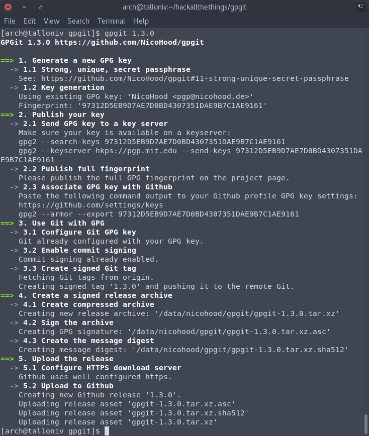

# GPGit


## Introduction
As we all know, today more than ever before, it is crucial to be able to trust
our computing environments. One of the main difficulties that package
maintainers of Linux distributions face, is the difficulty to verify the
authenticity and the integrity of the source code. With GPG signatures it is
possible for packagers to verify easily and quickly source code releases.

##### Overview of the required tasks:
* Create and/or use a **[4096-bit RSA keypair][1]** for the file signing
* Use a **[strong, unique, secret passphrase][2]** for the key
* Upload the public key to a **[key server][3]** and **[publish the full fingerprint][4]**
* **Sign** every new git **[commit][5]** and **[tag][6]**
* Create **[signed][7], [compressed][8]** (xz --best) release **archives**
* Upload a **[strong message digest][9]** (sha512) of the archive
* Configure **[HTTPS][10]** for your download server

#### GPGit
[GPGit][11] is meant to bring GPG to the masses. It is not only a python script
that automates the process of [creating new signed git releases with GPG][12]
but also comes with a [step-by-step readme guide][13] for learning how to use
GPG. GPGit integrates perfect with the [Github Release API][14] for uploading.

[1]: https://github.com/NicoHood/gpgit#12-key-generation
[2]: https://github.com/NicoHood/gpgit#11-strong-unique-secret-passphrase
[3]: https://github.com/NicoHood/gpgit#21-submit-your-key-to-a-key-server
[4]: https://github.com/NicoHood/gpgit#23-publish-your-full-fingerprint
[5]: https://github.com/NicoHood/gpgit#32-commit-signing
[6]: https://github.com/NicoHood/gpgit#33-create-signed-git-tag
[7]: https://github.com/NicoHood/gpgit#43-sign-the-sources
[8]: https://github.com/NicoHood/gpgit#41-create-compressed-archive
[9]: https://github.com/NicoHood/gpgit#42-create-the-message-digest
[10]: https://github.com/NicoHood/gpgit#52-configure-https-for-your-download-server
[11]: https://github.com/NicoHood/gpgit
[12]: https://github.com/NicoHood/gpgit#script-usage
[13]: https://github.com/NicoHood/gpgit#gpg-quick-start-guide
[14]: https://developer.github.com/v3/repos/releases/


## Index
* [Introduction](#introduction)
* [Installation](#installation)
* [Script Usage](#script-usage)
* [GPG quick start guide](#gpg-quick-start-guide)
* [Appendix](#appendix)
* [Contact][#contact]
* [Version History](#version-history)

## Installation
### ArchLinux
You can install gpgit from [AUR](https://aur.archlinux.org/packages/gpgit/).
Make sure to [build in a clean chroot](https://wiki.archlinux.org/index.php/DeveloperWiki:Building_in_a_Clean_Chroot).
Please give the package a vote so I can move it to the official ArchLinux
[community] repository for even simpler installation.

### Ubuntu/Debian/Other
GPGit dependencies can be easily installed via [pip](https://pypi.python.org/pypi/pip).

```bash
sudo apt-get install python pip gnupg git
pip install --user -r requirements.txt
```

## Script Usage
The script guides you through all 5 steps of the
[GPG quick start guide](#gpg-quick-start-guide). **By default no extra arguments
beside the tag are required.** Follow the instructions and you are good to go.



### Parameters

For more information checkout the help page:
```
$ gpgit --help
usage: gpgit.py [-h] [-v] [-m MESSAGE] [-o OUTPUT] [-g GIT_DIR]
                [-f FINGERPRINT] [-p PROJECT] [-e EMAIL] [-u USERNAME]
                [-c COMMENT] [-k KEYSERVER] [-n] [-a]
                [-t {gz,gzip,xz,bz2,bzip2} [{gz,gzip,xz,bz2,bzip2} ...]]
                [-s {sha256,sha384,sha512} [{sha256,sha384,sha512} ...]] [-b]
                tag

A Python script that automates the process of signing git sources via GPG.

positional arguments:
  tag                   Tagname

optional arguments:
  -h, --help            show this help message and exit
  -v, --version         show program's version number and exit
  -m MESSAGE, --message MESSAGE
                        tag message
  -o OUTPUT, --output OUTPUT
                        output path of the compressed archive, signature and
                        message digest
  -g GIT_DIR, --git-dir GIT_DIR
                        path of the git project
  -f FINGERPRINT, --fingerprint FINGERPRINT
                        (full) GPG fingerprint to use for signing/verifying
  -p PROJECT, --project PROJECT
                        name of the project, used for archive generation
  -e EMAIL, --email EMAIL
                        email used for gpg key generation
  -u USERNAME, --username USERNAME
                        username used for gpg key generation
  -c COMMENT, --comment COMMENT
                        comment used for gpg key generation
  -k KEYSERVER, --keyserver KEYSERVER
                        keyserver to use for up/downloading gpg keys
  -n, --no-github       disable Github API functionallity
  -a, --prerelease      Flag as Github prerelease
  -t {gz,gzip,xz,bz2,bzip2} [{gz,gzip,xz,bz2,bzip2} ...], --tar {gz,gzip,xz,bz2,bzip2} [{gz,gzip,xz,bz2,bzip2} ...]
                        compression option
  -s {sha256,sha384,sha512} [{sha256,sha384,sha512} ...], --sha {sha256,sha384,sha512} [{sha256,sha384,sha512} ...]
                        message digest option
  -b, --no-armor        do not create ascii armored signature output
```

### Configuration
Additional configuration can be made via [git config](https://git-scm.com/docs/git-config).

```bash
# GPGit settings
git config user.githubtoken <githubtoken>
git config user.gpgitoutput ~/gpgit

# GPG settings
git config user.signingkey <fingerprint>
git config commit.gpgsign true

# General settings
git config user.name <username>
git config user.email <email>
```

## GPG Quick Start Guide
GPGit guides you through 5 simple steps to get your software project ready
with GPG signatures. Further details can be found below.

1. [Generate a new GPG key](#1-generate-a-new-gpg-key)
    1. [Strong, unique, secret passphrase](#11-strong-unique-secret-passphrase)
    2. [Key generation](#12-key-generation)
2. [Publish your key](#2-publish-your-key)
    1. [Submit your key to a key server](#21-submit-your-key-to-a-key-server)
    2. [Associate GPG key with Github](#22-associate-gpg-key-with-github)
    3. [Publish your full fingerprint](#23-publish-your-full-fingerprint)
3. [Usage of GPG by git](#3-usage-of-gpg-by-git)
    1. [Configure git GPG key](#31-configure-git-gpg-key)
    2. [Commit signing](#32-commit-signing)
    3. [Create signed git tag](#33-create-signed-git-tag)
4. [Creation of a signed compressed release archive](#4-creation-of-a-signed-compressed-release-archive)
    1. [Create compressed archive](#41-create-compressed-archive)
    2. [Sign the sources](#42-create-the-message-digest)
    3. [Create the message digest](#43-sign-the-sources)
5. [Upload the release](#5-upload-the-release)
    1. [Github](#51-github)
    2. [Configure HTTPS for your download server](#52-configure-https-for-your-download-server)

### 1. Generate a new GPG key
#### 1.1 Strong, unique, secret passphrase
Make sure that your new passphrase for the GPG key meets high security
standards. If the passphrase/key is compromised all of your signatures are
compromised too.

Here are a few examples how to keep a passphrase strong but easy to remember:
* [How to Create a Secure Password](https://open.buffer.com/creating-a-secure-password/)
* [Mooltipass](https://www.themooltipass.com/)
* [Keepass](http://keepass.info/)

#### 1.2 Key generation
If you don't have a GPG key yet, create a new one first. You can use RSA
(4096 bits) or ECC (Curve 25519) for a strong key. The latter one does currently
not work with Github. You want to stay with RSA for now.

**Make sure that your secret key is stored somewhere safe and use a unique
strong password.**

Crucial key generation settings:
* (1) RSA and RSA
* 4096 bit key size
* 4096 bit subkey size
* Valid for 1 year (1y)
* Username and email

##### Example key generation:
```
$ gpg --full-gen-key --expert
[...]
gpg: /tmp/trustdb.gpg: trustdb created
gpg: key 61D68FF6279DF9A6 marked as ultimately trusted
gpg: directory '/tmp/openpgp-revocs.d' created
gpg: revocation certificate stored as
'/tmp/openpgp-revocs.d/3D6B9B41CCDC16D0E4A66AC461D68FF6279DF9A6.rev'
public and secret key created and signed.

pub   rsa4096 2017-01-04 [SC] [expires: 2018-01-04]
      3D6B9B41CCDC16D0E4A66AC461D68FF6279DF9A6
      3D6B9B41CCDC16D0E4A66AC461D68FF6279DF9A6
uid                      John Doe (gpgit example) <john@doe.com>
sub   rsa4096 2017-01-04 [E] [expires: 2018-01-04]
```

The generated key has the fingerprint `3D6B9B41CCDC16D0E4A66AC461D68FF6279DF9A6`
in this example. Share it with others so they can verify your source.
[[Read more]](https://wiki.archlinux.org/index.php/GnuPG#Create_key_pair)

If you ever move your installation make sure to backup `~/.gnupg/` as it
contains the private key and the revocation certificate. Handle it with care.
[[Read more]](https://wiki.archlinux.org/index.php/GnuPG#Revoking_a_key)

### 2. Publish your key

#### 2.1 Submit your key to a key server
To make the public key widely available, upload it to a key server.
Now the user can get your key by requesting the fingerprint from the keyserver:
[[Read more]](https://wiki.archlinux.org/index.php/GnuPG#Use_a_keyserver)

```bash
# Publish key
gpg --keyserver hkps://hkps.pool.sks-keyservers.net --send-keys <fingerprint>6

# Import key
gpg --keyserver hkps://hkps.pool.sks-keyservers.net --recv-keys <fingerprint>
```

#### 2.2 Associate GPG key with Github
To make Github display your commits as "verified" you also need to add your
public [GPG key to your Github profile](https://github.com/settings/keys).
[[Read more]](https://help.github.com/articles/generating-a-gpg-key/)

```bash
# List keys + full fingerprint
gpg --list-secret-keys --keyid-format LONG

# Generate public key
gpg --armor --export <fingerprint>
```

#### 2.3 Publish your full fingerprint
To make it easy for everyone else to find your key it is crucial that you
publish the [**full fingerprint**](https://lkml.org/lkml/2016/8/15/445) on a trusted platform, such as your website or Github.
To give the key more trust other users can sign your key too.
[[Read more]](https://wiki.debian.org/Keysigning)

### 3. Usage of GPG by git
#### 3.1 Configure git GPG key
In order to make git use your GPG key you need to set the default signing key
for git.
[[Read more]](https://help.github.com/articles/telling-git-about-your-gpg-key/)

```bash
# List keys + full fingerprint
gpg --list-secret-keys --keyid-format LONG

git config --global user.signingkey <fingerprint>
```

#### 3.2 Commit signing
To verify the git history, git commits needs to be signed. You can manually sign
commits or enable it by default for every commit. It is recommended to globally
enable git commit signing.
[[Read more]](https://help.github.com/articles/signing-commits-using-gpg/)

```bash
git config --global commit.gpgsign true
```

#### 3.3 Create signed git tag
Git tags need to be created from the command line and always need a switch to
enable tag signing.
[[Read more]](https://help.github.com/articles/signing-tags-using-gpg/)

```bash
# Creates a signed tag
git tag -s mytag

# Verifies the signed tag
git tag -v mytag
```

### 4. Creation of a signed compressed release archive
#### 4.1 Create compressed archive
You can use `git archive` to create archives of your tagged git release. It is
highly recommended to use a strong compression which is especially beneficial
for those countries with slow and unstable internet connections.
[[Read more]](https://git-scm.com/docs/git-archive)

```bash
# .tar.gz
git archive --format=tar.gz -o gpgit-1.0.0.tar.gz --prefix gpgit-1.0.0 1.0.0

# .tar.xz
git archive --format=tar --prefix gpgit-1.0.0 1.0.0 | xz > gpgit-1.0.0.tar.xz

# .tar.lz
git archive --format=tar --prefix gpgit-1.0.0 1.0.0 | lzip --best > gpgit-1.0.0.tar.xz

# Verify an existing archive
git archive --format=tar --prefix gpgit-1.0.0 1.0.0 | cmp <(xz -dc gpgit-1.0.0.tar.xz)
```

#### 4.2 Sign the sources
Type the filename of the tarball that you want to sign and then run:
```bash
gpg --armor --detach-sign gpgit-1.0.0.tar.xz
```
Do not blindly sign the Github source downloads unless you have compared its
content with the local files via `diff.`
[[Read more]](https://wiki.archlinux.org/index.php/GnuPG#Make_a_detached_signature)

To not need to retype your password every time for signing you can also use
[gpg-agent](https://wiki.archlinux.org/index.php/GnuPG#gpg-agent).

This gives you a file called `gpgit-1.0.0.tar.xz.asc` which is the GPG
signature. Release it along with your source tarball and let everyone know
to first verify the signature after downloading.
[[Read more]](https://wiki.archlinux.org/index.php/GnuPG#Verify_a_signature)

```bash
gpg --verify gpgit-1.0.0.tar.xz.asc
```

#### 4.3 Create the message digest
Message digests are used to ensure the integrity of a file. It can also serve as
checksum to verify the download. Message digests **do not** replace GPG
signatures. They rather provide and alternative simple way to verify the source.
Make sure to provide message digest over a secure channel like https.

```bash
sha512 gpgit-1.0.0.tar.xz > gpgit-1.0.0.tar.xz.sha512
```

### 5. Upload the release
#### 5.1 Github
Create a new "Github Release" to add additional data to the tag. Then drag the
.tar.xz .sig and .sha512 file onto the release.

The script also supports uploading to Github directly. Create a new Github token
first and then follow the instructions of the script.

How to generate a Github token:
* Go to ["Settings - Personal access tokens"](https://github.com/settings/tokens)
* Generate a new token with permissions "public_repo" and "admin:gpg_key"
* Store it safely

#### 5.2 Configure HTTPS for your download server
* [Why HTTPS Matters](https://developers.google.com/web/fundamentals/security/encrypt-in-transit/why-https)
* [Let's Encrypt](https://letsencrypt.org/)
* [SSL Server Test](https://www.ssllabs.com/ssltest/)

## Appendix

### Email Encryption
You can also use your GPG key for email encryption
with [enigmail and thunderbird](https://wiki.archlinux.org/index.php/thunderbird#EnigMail_-_Encryption).
[[Read more]](https://www.enigmail.net/index.php/en/)

## Contact
You can get securely in touch with me [here](http://contact.nicohood.de).
Don't hesitate to [file a bug at Github](https://github.com/NicoHood/gpgit/issues).
More cool projects from me can be found [here](http://www.nicohood.de).

## Version History
```
1.2.0 (24.04.2017)
* Trap on errors
* Detect gpg2
* Fix git tags pull/push
* Small code fixes
* Thanks @cmaglie with #3

1.1.2 (22.01.2017)
* Fixed Github uploading name

1.1.1 (17.01.2017)
* Verify existing signatures
* Added upload to Github functionality
* Only allow secure GPG keys

1.1.0 (13.01.2017)
* Added online source download
* Added source verification
* Added multiple compression algorithms
* Added multiple sha algorithms
* Minor fixes
* Updated Readme

1.0.0 (07.01.2017)
* Merged all scripts into gpgit.sh
* First release with all functions working except the uploading

Untagged Release (16.12.2016)
* Initial release of the software
```
